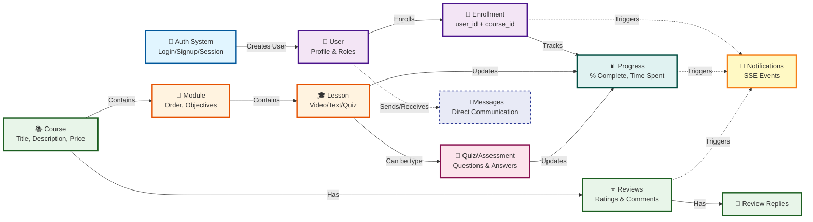
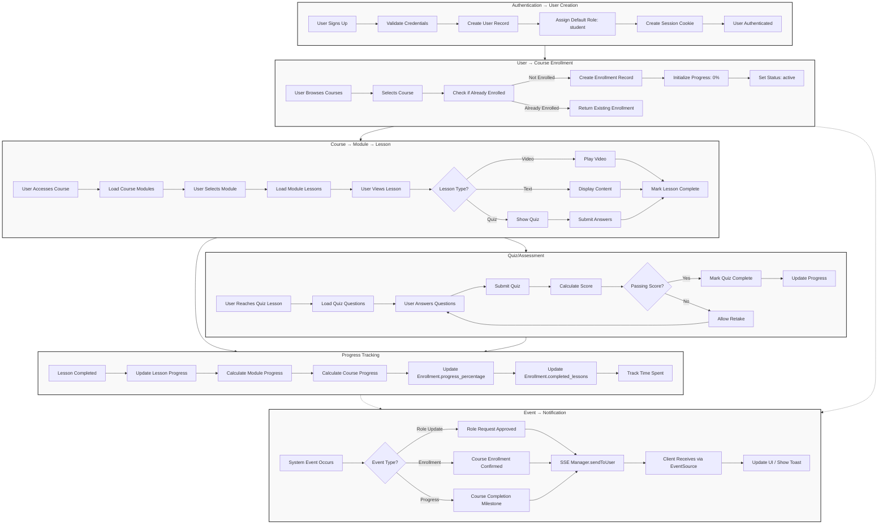
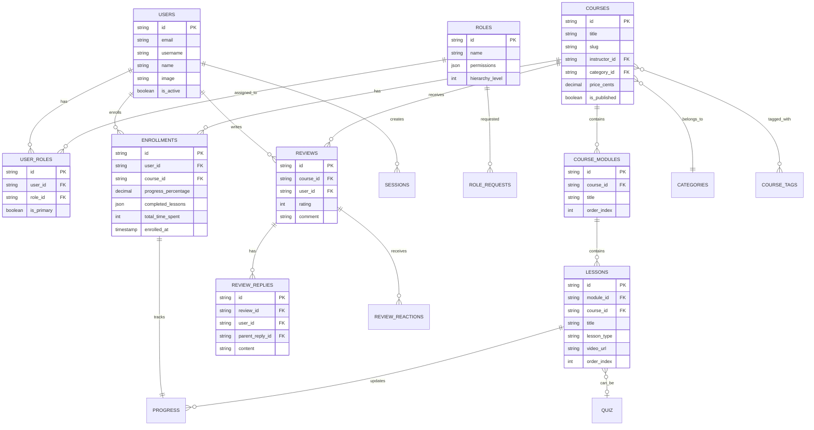

# AxioQuan E-Learning Platform - Data Flow Diagram

## Main Data Flow Diagram



## Detailed Subsystem Flow



## Data Flow Sequence

### 1. User Registration & Authentication
```
Auth System → Creates User → Assigns Roles → Creates Session
```

### 2. Course Enrollment Flow
```
User → Browses Courses → Enrolls → Creates Enrollment Record → Links to Course
```

### 3. Learning Flow
```
User → Accesses Course → Views Modules → Completes Lessons → Updates Progress
```

### 4. Assessment Flow
```
User → Reaches Quiz Lesson → Answers Questions → Submits Answers → Updates Progress
```

### 5. Progress Tracking Flow
```
Lesson Completion → Updates Lesson Progress → Aggregates to Module Progress → 
Updates Course Progress → Stores in Enrollment
```

### 6. Notification Flow
```
Any System Event → Triggers Notification → SSE Manager → Broadcasts to User → 
Client Receives → Updates UI
```

## Database Entity Relationships



## Key Data Relationships

1. **User ↔ Enrollment ↔ Course**: Many-to-many relationship (users enroll in multiple courses)
2. **Course → Module → Lesson**: Hierarchical one-to-many (course contains modules, modules contain lessons)
3. **Lesson → Quiz**: One-to-one (lesson can be a quiz type)
4. **Enrollment → Progress**: One-to-one tracking (each enrollment tracks its own progress)
5. **User → Notifications**: One-to-many via SSE (notifications table exists but queries pending)
6. **Course → Reviews → Replies**: Social interaction tree (reviews can have nested replies)
7. **User → Roles**: Many-to-many (users can have multiple roles, one primary)


