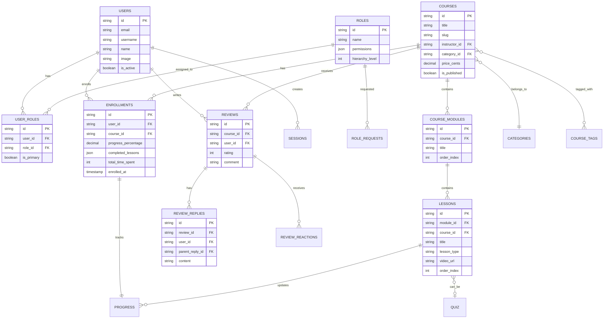

# AxioQuan E-Learning Platform - Data Flow Diagram

## Main Data Flow Diagram

```mermaid
flowchart LR
    %% Start with Authentication
    Auth[🔐 Auth System<br/>Login/Signup/Session] -->|Creates User| User[👤 User<br/>Profile & Roles]
    
    %% User enrolls in courses
    User -->|Enrolls| Enrollment[📝 Enrollment<br/>user_id + course_id]
    
    %% Course structure
    Course[📚 Course<br/>Title, Description, Price] -->|Contains| Module[📖 Module<br/>Order, Objectives]
    Module -->|Contains| Lesson[🎓 Lesson<br/>Video/Text/Quiz]
    
    %% Assessment as lesson type
    Lesson -->|Can be type| Quiz[📝 Quiz/Assessment<br/>Questions & Answers]
    
    %% Progress tracking
    Enrollment -->|Tracks| Progress[📊 Progress<br/>% Complete, Time Spent]
    Lesson -->|Updates| Progress
    Quiz -->|Updates| Progress
    
    %% Social features
    Course -->|Has| Reviews[⭐ Reviews<br/>Ratings & Comments]
    Reviews -->|Has| Replies[💬 Review Replies]
    
    %% Messaging (placeholder)
    User -.->|Sends/Receives| Messages[💬 Messages<br/>Direct Communication]
    
    %% Notifications
    Enrollment -.->|Triggers| Notifications[🔔 Notifications<br/>SSE Events]
    Progress -.->|Triggers| Notifications
    Reviews -.->|Triggers| Notifications
    
    %% Styling
    classDef authClass fill:#e1f5ff,stroke:#01579b,stroke-width:3px
    classDef userClass fill:#f3e5f5,stroke:#4a148c,stroke-width:3px
    classDef courseClass fill:#e8f5e9,stroke:#1b5e20,stroke-width:3px
    classDef curriculumClass fill:#fff3e0,stroke:#e65100,stroke-width:3px
    classDef assessmentClass fill:#fce4ec,stroke:#880e4f,stroke-width:3px
    classDef progressClass fill:#e0f2f1,stroke:#004d40,stroke-width:3px
    classDef socialClass fill:#f1f8e9,stroke:#33691e,stroke-width:3px
    classDef notificationClass fill:#fff9c4,stroke:#f57f17,stroke-width:3px
    classDef messagingClass fill:#e8eaf6,stroke:#283593,stroke-width:2px,stroke-dasharray: 5 5

    class Auth authClass
    class User,Enrollment userClass
    class Course,Reviews,Replies courseClass
    class Module,Lesson curriculumClass
    class Quiz assessmentClass
    class Progress progressClass
    class Messages messagingClass
    class Notifications notificationClass
```



## Detailed Subsystem Flow


## Data Flow Sequence

### 1. User Registration & Authentication
```
Auth System → Creates User → Assigns Roles → Creates Session
```

### 2. Course Enrollment Flow
```
User → Browses Courses → Enrolls → Creates Enrollment Record → Links to Course
```

### 3. Learning Flow
```
User → Accesses Course → Views Modules → Completes Lessons → Updates Progress
```

### 4. Assessment Flow
```
User → Reaches Quiz Lesson → Answers Questions → Submits Answers → Updates Progress
```

### 5. Progress Tracking Flow
```
Lesson Completion → Updates Lesson Progress → Aggregates to Module Progress → 
Updates Course Progress → Stores in Enrollment
```

### 6. Notification Flow
```
Any System Event → Triggers Notification → SSE Manager → Broadcasts to User → 
Client Receives → Updates UI
```

## Database Entity Relationships



## Key Data Relationships

1. **User ↔ Enrollment ↔ Course**: Many-to-many relationship (users enroll in multiple courses)
2. **Course → Module → Lesson**: Hierarchical one-to-many (course contains modules, modules contain lessons)
3. **Lesson → Quiz**: One-to-one (lesson can be a quiz type)
4. **Enrollment → Progress**: One-to-one tracking (each enrollment tracks its own progress)
5. **User → Notifications**: One-to-many via SSE (notifications table exists but queries pending)
6. **Course → Reviews → Replies**: Social interaction tree (reviews can have nested replies)
7. **User → Roles**: Many-to-many (users can have multiple roles, one primary)


