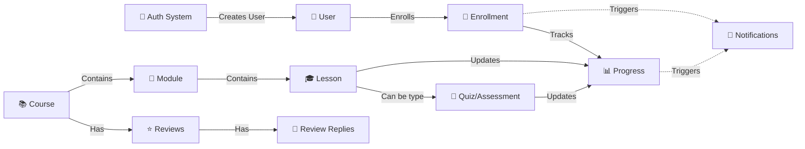

# AxioQuan Platform Architecture Overview

**Version:** 1.0  
**Last Updated:** 2024  
**Purpose:** Engineering Onboarding Documentation

---

## Table of Contents

1. [Executive Summary](#executive-summary)
2. [Platform Overview](#platform-overview)
3. [Technology Stack](#technology-stack)
4. [System Architecture](#system-architecture)
5. [Repository Structure](#repository-structure)
6. [Major Features & Implementation](#major-features--implementation)
7. [Data Flow & System Interactions](#data-flow--system-interactions)
8. [Domain Concepts Glossary](#domain-concepts-glossary)
9. [Key Entry Points](#key-entry-points)
10. [Development Workflow](#development-workflow)

---

## Executive Summary

AxioQuan is a comprehensive e-learning platform built with Next.js 16 and React 19, designed to support multi-role users (students, instructors, and administrators) in creating, managing, and consuming educational content. The platform features course management, curriculum building, progress tracking, assessments, social interactions, and real-time notifications.

The architecture follows modern web development best practices with server-side rendering, server actions for mutations, and a component-based UI architecture. The system uses PostgreSQL for data persistence, Cloudinary for media management, and Server-Sent Events for real-time communication.

---

## Platform Overview

### Core Capabilities

**For Students:**
- Browse and enroll in courses
- Access structured learning content (modules and lessons)
- Complete assessments and track progress
- Earn certificates upon course completion
- Interact with course reviews and social features
- Receive real-time notifications

**For Instructors:**
- Create and manage courses
- Build curriculum with modules and lessons
- Track student enrollment and progress
- View analytics and earnings
- Manage course content and publishing

**For Administrators:**
- Manage users and roles
- Oversee categories and tags
- Review role upgrade requests
- System maintenance and cleanup

### User Roles & Permissions

The platform implements a role-based access control (RBAC) system with three primary roles:

- **Student**: Default role for all new users; can enroll in courses and access learning content
- **Instructor**: Can create courses, manage curriculum, and view student analytics
- **Admin**: Full system access including user management, category/tag administration, and role approvals

Users can have multiple roles assigned, with one marked as "primary" to determine their default dashboard view. Role upgrades require admin approval through a request system.

---

## Technology Stack

### Frontend
- **Framework**: Next.js 16 (App Router)
- **UI Library**: React 19
- **Language**: TypeScript
- **Styling**: Tailwind CSS
- **Component Library**: shadcn/ui (59+ components built on Radix UI)
- **State Management**: Zustand (client state) + Server Components (server state)
- **Form Handling**: React Hook Form with Zod validation

### Backend
- **Runtime**: Node.js
- **API**: Next.js API Routes + Server Actions
- **Database**: PostgreSQL (Neon serverless)
- **Media Storage**: Cloudinary
- **Email**: Nodemailer
- **Real-time**: Server-Sent Events (SSE)

### Infrastructure
- **Database**: Neon PostgreSQL (serverless, connection pooling)
- **Media CDN**: Cloudinary
- **Authentication**: Cookie-based sessions (HTTP-only)
- **Deployment**: Vercel (implied by Next.js)

---

## System Architecture

### High-Level Architecture

The platform follows a three-tier architecture:

1. **Presentation Layer**: Next.js App Router with Server and Client Components
2. **Application Layer**: Server Actions and API Routes handling business logic
3. **Data Layer**: PostgreSQL database with direct SQL queries (no ORM)

### Frontend Architecture

**App Router Structure:**
- Route groups for logical organization (e.g., `(auth)` for authentication pages)
- Dynamic routes for resource-specific pages (`[slug]`, `[id]`)
- Layout hierarchy: Root → Auth → Dashboard layouts
- Server Components by default for better performance
- Client Components marked with `'use client'` for interactivity

**Component Organization:**
- Feature-based structure: Components organized by domain (courses, auth, dashboard)
- Shared UI library: Reusable components in `/components/ui`
- Layout components: Header, sidebar, footer for consistent navigation
- Server Actions: Business logic in `/lib` with `'use server'` directives

### Backend Architecture

**API Routes:**
- RESTful endpoints organized by resource (`/api/courses`, `/api/auth`, `/api/reviews`)
- Dynamic segments for resource-specific operations
- Route handlers using Next.js Request/Response API

**Server Actions:**
- Type-safe server functions called directly from client components
- No fetch required - direct function calls
- Handle authentication, validation, and database operations
- Return structured responses with success/error states

**Database Layer:**
- Direct SQL queries using tagged template literals
- Query functions organized by domain in `/lib/db/queries`
- Connection via Neon serverless driver (automatic connection pooling)
- No ORM - direct control over queries for performance

### State Management

**Server State:**
- Data fetched in Server Components and passed as props
- No client-side data fetching libraries (React Query/SWR)
- Direct database queries in server components

**Client State:**
- Zustand stores for UI state (theme, user, UI preferences)
- React state for component-specific data
- React Hook Form for form state management
- Custom hooks for reusable state logic

**Session State:**
- Cookie-based authentication (HTTP-only cookies)
- Session data retrieved server-side via `getSession()`
- Auto-refresh mechanism for active sessions

---

## Repository Structure

### Root Directory

```
AxioQuan-ELearning-499-Capstone/
├── hooks/              # Custom React hooks
├── lib/                # Core business logic & utilities
├── public/             # Static assets
├── src/                # Application source code
├── types/               # TypeScript type definitions
└── Configuration files (package.json, tsconfig.json, etc.)
```

### Key Directories

**`/hooks`** - Custom React Hooks
- Reusable client-side logic for navigation, search, mobile detection, server events, and toast notifications

**`/lib`** - Business Logic Layer
- `/lib/auth` - Authentication, session management, password handling, role management
- `/lib/courses` - Course and curriculum management
- `/lib/db` - Database connection and query functions
- `/lib/cloudinary` - Media upload and management
- `/lib/social` - Review and social interaction features
- `/lib/sse` - Real-time notification system
- `/lib/store` - Client-side state management (Zustand)
- `/lib/email` - Email sending utilities and templates

**`/src/app`** - Next.js App Router
- `/(auth)` - Authentication pages (login, signup, password reset)
- `/api` - API route handlers
- `/courses` - Course browsing and learning pages
- `/dashboard` - Role-based dashboard pages
- `/categories` - Category browsing pages

**`/src/components`** - React Components
- Organized by feature domain (auth, courses, dashboard, etc.)
- `/components/ui` - Reusable UI component library
- `/components/layout` - Application layout components

**`/types`** - TypeScript Definitions
- Database schema types
- Domain model types (Course, User, etc.)
- API request/response types

---

## Major Features & Implementation

### Authentication & Authorization

**Purpose**: Secure user authentication, session management, and role-based access control.

**Key Components**:
- Login/signup forms with password validation
- Session management via HTTP-only cookies
- Role assignment and permission checking
- Password reset via email tokens
- OAuth social login support (planned)

**Entry Points**:
- Routes: `/login`, `/signup`, `/forgot-password`, `/reset-password`
- API: `/api/auth/status`, `/api/auth/refresh`, `/api/auth/logout`

**Files**:
- `lib/auth/actions.ts` - Authentication server actions
- `lib/auth/session.ts` - Session management
- `src/components/auth/*` - Authentication UI components
- `src/app/(auth)/*` - Authentication pages

### User Profiles

**Purpose**: Manage user profile data, images, skills, and role upgrade requests.

**Key Components**:
- Profile editing forms
- Profile image upload (Cloudinary integration)
- Skills and social links management
- Role upgrade request system
- Profile completion tracking

**Entry Points**:
- Route: `/dashboard/profile`
- API: `/api/user/profile`

**Files**:
- `lib/auth/profile-actions.ts` - Profile management actions
- `src/components/users/*` - Profile UI components
- `src/app/dashboard/profile/page.tsx` - Profile page

### Courses

**Purpose**: Complete course management including creation, editing, publishing, enrollment, and display.

**Key Components**:
- Course catalog with filtering and search
- Course detail pages with curriculum preview
- Course creation and editing interfaces
- Enrollment management
- Course reviews and ratings

**Entry Points**:
- Routes: `/courses`, `/courses/[slug]`, `/courses/learn/[id]`
- API: `/api/courses`, `/api/courses/[id]`, `/api/courses/search`

**Files**:
- `lib/courses/actions.ts` - Course server actions
- `lib/db/queries/courses.ts` - Course database queries
- `src/components/courses/*` - Course UI components
- `src/app/courses/*` - Course pages

### Curriculum

**Purpose**: Manage course structure with modules and lessons, supporting various content types.

**Key Components**:
- Drag-and-drop curriculum builder
- Module and lesson editors
- Lesson player for video, text, and interactive content
- Lesson ordering and publishing controls

**Entry Points**:
- Route: `/dashboard/instructor/courses/[id]/curriculum`
- API: `/api/modules/[id]`, `/api/lessons/[id]`

**Files**:
- `lib/courses/curriculum-actions.ts` - Curriculum server actions
- `lib/db/queries/curriculum.ts` - Curriculum database queries
- `src/components/curriculum/*` - Curriculum UI components

### Assessments

**Purpose**: Quiz and assessment system for evaluating student knowledge.

**Key Components**:
- Quiz interface with multiple question types
- Timer functionality and scoring
- Results display with explanations
- Progress tracking integration

**Entry Points**:
- Route: `/courses/quiz/[id]`

**Files**:
- `src/components/courses/quiz-page.tsx` - Quiz component
- `src/app/courses/quiz/[id]/page.tsx` - Quiz page

**Status**: UI fully implemented; database integration pending

### Progress Tracking

**Purpose**: Track student learning progress through courses, modules, and lessons.

**Key Components**:
- Enrollment progress percentage
- Completed lessons tracking
- Time spent tracking
- Course completion detection

**Entry Points**:
- API: `/api/student/progress`
- Route: `/dashboard/progress`

**Files**:
- `lib/db/queries/enrollments.ts` - Progress database queries
- `src/components/dashboard/progress-page.tsx` - Progress UI

### Reviews & Ratings

**Purpose**: Social interaction system for course feedback and discussion.

**Key Components**:
- Star rating system (1-5 stars)
- Review comments and nested replies
- Like/dislike reactions on reviews
- Review moderation

**Entry Points**:
- API: `/api/reviews`, `/api/reviews/[id]/reactions`, `/api/reviews/[id]/replies`

**Files**:
- `lib/social/review-actions.ts` - Review server actions
- `lib/db/queries/reviews.ts` - Review database queries
- `src/components/reviews/*` - Review UI components

### Notifications & Real-time

**Purpose**: Real-time notification system for system events and user updates.

**Key Components**:
- Server-Sent Events (SSE) for live updates
- Role request notifications
- Course milestone notifications
- Connection management and heartbeats

**Entry Points**:
- API: `/api/sse`
- Route: `/dashboard/inbox`

**Files**:
- `lib/sse/server-events.ts` - SSE event manager
- `hooks/use-server-events.ts` - Client-side SSE hook
- `src/components/providers/realtime-provider.tsx` - SSE provider

### Categories & Tags

**Purpose**: Organization system for courses with hierarchical categories and flexible tagging.

**Key Components**:
- Category management interface
- Tag management and assignment
- Category browsing pages
- Tag-based filtering

**Entry Points**:
- Routes: `/categories`, `/categories/[slug]`
- API: `/api/categories`, `/api/tags`

**Files**:
- `lib/categories/actions.ts`, `lib/tags/actions.ts` - Management actions
- `src/components/categories/*`, `src/components/tags/*` - UI components

---

## Data Flow & System Interactions

### Authentication Flow

```
User Login Request
  → Login Form Component
  → Authentication Server Action
  → Password Verification (bcrypt)
  → Session Creation
  → HTTP-only Cookie Set
  → Redirect to Dashboard
```

### Course Enrollment Flow

```
User Browses Courses
  → Course Detail Page Loads
  → Enrollment Check
  → User Clicks "Enroll"
  → Enrollment Server Action
  → Database: Create Enrollment Record
  → Update Course Student Count
  → UI Updates to Show Enrollment
```

### Learning Flow

```
User Accesses Course
  → Load Course Curriculum (Modules & Lessons)
  → User Selects Lesson
  → Lesson Player Loads Content
  → User Watches/Completes Lesson
  → Progress Updated (Client-side)
  → Progress Persisted to Database (when implemented)
```

### Assessment Flow

```
User Reaches Quiz Lesson
  → Quiz Component Loads Questions
  → User Answers Questions
  → Submit Quiz
  → Score Calculated
  → Results Displayed
  → Progress Updated (when backend connected)
```

### Progress Tracking Flow

```
Lesson Completion
  → Update Lesson Progress
  → Calculate Module Progress
  → Calculate Course Progress
  → Update Enrollment Record
  → Check for Course Completion (100%)
  → Trigger Certificate Generation (if applicable)
```

### Notification Flow

```
System Event Occurs
  → Event Type Determined
  → SSE Manager Broadcasts Event
  → Connected Clients Receive Event
  → UI Updates / Toast Notification
```

### Data Flow Diagram



---

## Domain Concepts Glossary

### Authentication & Authorization

**Account** - An OAuth provider account linked to a user, storing authentication tokens and provider-specific data for social login integration.

**Role** - A permission set defining user capabilities (student, instructor, admin) with hierarchical levels and granular permissions stored as JSON.

**RoleRequest** - A user's request to upgrade their role (e.g., student to instructor), including justification, qualifications, and admin review status.

**Session** - An active user authentication session stored in database and cookies, containing user ID, roles, expiration time, and device information.

**UserRole** - A many-to-many relationship between users and roles, with one role marked as primary and optional expiration dates for temporary assignments.

**VerificationToken** - A time-limited token used for email verification and password reset operations, marked as used after consumption.

### User Management

**User** - The core user entity containing authentication credentials, profile information, account status, and basic metadata like timezone and locale.

**UserProfile** - Extended user profile data including social links, skills, portfolio URLs, learning goals, and professional information beyond basic user data.

### Course Structure

**Course** - A complete learning program created by an instructor, containing modules, pricing, metadata, statistics, and publication status.

**Module** - A logical grouping of lessons within a course, organized by order index with learning objectives and estimated duration.

**Lesson** - An individual learning unit within a module, supporting multiple types (video, text, quiz, assignment) with content, media URLs, and completion criteria.

**Category** - A hierarchical classification system for organizing courses, with parent-child relationships and descriptive metadata.

**Tag** - A flexible labeling system for courses, allowing multiple tags per course for enhanced searchability and filtering.

**CourseTag** - The many-to-many relationship between courses and tags, tracking usage counts and featured status.

### Learning & Progress

**Enrollment** - The relationship between a user and a course, tracking enrollment status, progress percentage, completed lessons, and time spent.

**Progress** - Learning progress data aggregated at the enrollment level, including completion percentage, completed lesson IDs, and total time invested.

**ProgressRecord** - Individual lesson completion records that aggregate into overall course progress, tracking completion status and time spent per lesson.

### Assessments

**Assessment** - A type of lesson that evaluates student knowledge through questions, supporting multiple question types (multiple-choice, true/false, essay, code).

**Quiz** - An interactive assessment lesson type with questions, correct answers, scoring, passing thresholds, and time limits.

**Question** - An individual assessment item within a quiz, with type-specific data (options, correct answer, points, explanation).

**Answer** - A student's response to a quiz question, stored with the question ID and evaluated against correct answers for scoring.

### Social Features

**Review** - A user's rating and written feedback for a course, including star rating (1-5), comment text, and timestamps.

**ReviewReply** - A nested comment thread on reviews, allowing users and instructors to respond to reviews with parent-child relationships.

**ReviewReaction** - User interactions on reviews (like/dislike), tracked per user to prevent duplicate reactions and aggregated for display.

### Communication

**Notification** - A system-generated message alerting users to events (role updates, course milestones, new messages), delivered via Server-Sent Events.

**Message** - Direct communication between users (planned feature), supporting one-on-one conversations and group messaging.

### Media & Content

**LessonTranscript** - Text transcription of video/audio lessons, supporting multiple languages with auto-generation flags and confidence scores.

**Certificate** - A digital certificate awarded upon course completion, generated when a student reaches 100% progress and certificate_available is true.

### System Concepts

**Server-Sent Events (SSE)** - A real-time communication protocol for pushing notifications from server to client, maintaining persistent connections for live updates.

**Session Cookie** - An HTTP-only cookie storing encrypted session data (user ID, roles, expiration) for authentication state management.

**Primary Role** - The main role that determines a user's dashboard view and default permissions, with users able to have multiple roles but only one primary.

**Access Type** - A course setting defining enrollment requirements (open, paid, approval-required) controlling how students can join courses.

**Difficulty Level** - A course classification (beginner, intermediate, advanced, all-levels) helping students find appropriately challenging content.

**Content Type** - A course categorization (video-based, text-based, mixed) indicating the primary delivery method for course materials.

**Enrollment Status** - The state of a user's enrollment (active, completed, cancelled, expired) tracked in the enrollment record.

**Publishing Status** - A course's visibility state (published, draft, archived) controlling whether courses appear in public listings and are accessible to students.

---

## Key Entry Points

### User-Facing Routes

**Authentication:**
- `/login` - User login page
- `/signup` - User registration
- `/forgot-password` - Password recovery
- `/reset-password` - Password reset completion

**Course Browsing:**
- `/courses` - Course catalog with filters
- `/courses/[slug]` - Individual course detail page
- `/categories` - Category listing
- `/categories/[slug]` - Category detail with courses

**Learning:**
- `/courses/learn/[id]` - Course learning interface
- `/courses/watch/[courseId]/[lessonId]` - Video lesson player
- `/courses/quiz/[id]` - Quiz/assessment page

**Dashboard:**
- `/dashboard` - Main dashboard (role-based)
- `/dashboard/my-courses` - Student's enrolled courses
- `/dashboard/progress` - Learning progress tracking
- `/dashboard/profile` - User profile management
- `/dashboard/certificates` - Earned certificates
- `/dashboard/inbox` - Notifications and messages

**Instructor:**
- `/dashboard/instructor/courses` - Course management
- `/dashboard/instructor/courses/[id]/curriculum` - Curriculum editor
- `/dashboard/instructor/create` - New course creation
- `/dashboard/instructor/analytics` - Course analytics

**Admin:**
- `/dashboard/admin` - Admin dashboard
- `/dashboard/admin/categories` - Category management
- `/dashboard/admin/tags` - Tag management

### API Endpoints

**Authentication:**
- `GET /api/auth/status` - Check authentication status
- `POST /api/auth/refresh` - Refresh session token
- `POST /api/auth/logout` - Logout endpoint

**Courses:**
- `GET /api/courses` - List all courses
- `GET /api/courses/[id]` - Get course by ID
- `POST /api/courses` - Create new course
- `PUT /api/courses/[id]` - Update course
- `GET /api/courses/search` - Search courses

**Curriculum:**
- `GET /api/modules/[id]` - Get module details
- `POST /api/modules/[id]` - Create module
- `GET /api/lessons/[id]` - Get lesson details

**Reviews:**
- `GET /api/reviews` - List reviews
- `POST /api/reviews` - Create review
- `POST /api/reviews/[id]/reactions` - Toggle reaction

**Real-time:**
- `GET /api/sse` - Server-Sent Events connection

---

## Development Workflow

### Getting Started

1. **Environment Setup:**
   - Node.js 18+ and pnpm package manager
   - PostgreSQL database (Neon recommended)
   - Cloudinary account for media storage
   - Environment variables configured (`.env.local`)

2. **Database Setup:**
   - Connection string in `DATABASE_URL`
   - Schema migrations (if applicable)
   - Seed data for development

3. **Development Server:**
   - Run `pnpm dev` to start Next.js development server
   - Access application at `http://localhost:3000`

### Code Organization Principles

- **Server Components First**: Default to server components for better performance
- **Server Actions for Mutations**: Use server actions instead of API routes for form submissions
- **Direct SQL Queries**: No ORM - use tagged template literals for database queries
- **Feature-Based Organization**: Group related files by domain/feature
- **Type Safety**: TypeScript types defined in `/types` directory

### Common Patterns

**Authentication Check:**
- Server Component: `const session = await getSession(); if (!session) redirect('/login');`
- Server Action: `const session = await requireAuth();`

**Role-Based Access:**
- `await requireRole('instructor');`
- `await requireAnyRole(['instructor', 'admin']);`

**Database Query:**
- Direct SQL using tagged template literals
- Query functions in `/lib/db/queries` organized by domain

**Server Action:**
- Mark with `'use server'`
- Return structured responses with success/error states

### Testing Considerations

- Server actions can be tested independently
- Database queries should use test database in development
- UI components use React Testing Library patterns
- API routes follow REST conventions

### Deployment

- Platform optimized for Vercel deployment
- Environment variables required for production
- Database connection pooling handled by Neon
- Media assets served via Cloudinary CDN

---

## Additional Resources

### Important Notes

**Implementation Status:**
- Core features (auth, courses, enrollment) are fully implemented
- Quiz/assessment UI is complete; database integration pending
- Certificate generation is planned but not yet implemented
- Direct messaging system is planned but not yet implemented
- Notification system uses SSE; database queries file exists but is empty

**Architecture Decisions:**
- No ORM for direct SQL control and performance
- Cookie-based sessions for simplicity and security
- Server-Sent Events over WebSockets for notification use case
- Server Components by default for optimal performance
- Feature-based code organization for maintainability

---

## Conclusion

This architecture overview provides a comprehensive foundation for understanding the AxioQuan platform. The system is designed for scalability, maintainability, and developer experience, following modern web development best practices.

For specific implementation details, refer to the codebase and inline documentation. For questions or clarifications, consult the development team or review the detailed documentation files referenced above.

---

**Document Version:** 1.0  
**Last Updated:** 2024  
**Maintained By:** AxioQuan Engineering Team

